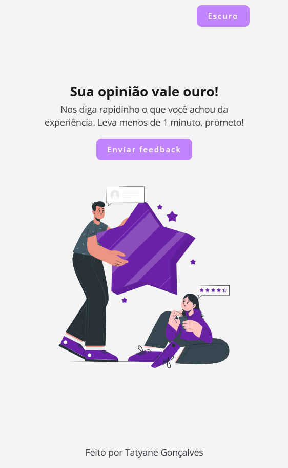

# 📄 Modal Interativo para site de feedback
> Modal customizado feito com **HTML5**, **CSS** e **JavaScript**, que aparece para o usuário assim que ele clicar no botão `Enviar Feedback`.
> A missão foi simples: praticar o que venho aprendendo na marra, escrevendo código de verdade.

---


## 🚀 Demonstração
[🔗 Link para o projeto em produção](https://interactive-modal.vercel.app/)


---

## 🧠 Funcionalidades
- ✅ Modal abre ao clicar em `Enviar feedback`
- ✅ Pode ser fechado via:
  - Botão `X`
  - Clicar fora (overlay)
  - Tecla `ESC`
- ✅ Campo `textarea` para digitar feedback 
- ✅ Botão `Enviar feedback` com:
  - Validação do campo
  - Loader (spinner de carregamento)
  - Mensagem de "Obrigado pelo feedback!"
  - Fecha o modal automaticamente após 2s
- ✅ Acessibilidade:
  - Foco automático no textarea
  - Navegação via teclado (TAB)
- ✅ Responsivo (funciona bem em celular e desktop)
- ✅ Tema claro/escuro com troca dinâmica
- ✅ Feedbacks são armazenados em um array no JS

---

## 🛠️  Tecnologias Usadas
Esse projeto foi desenvolvido com as seguintes tecnologias:

- HTML5 
- CSS (estilização moderna com animações, hover, transições)
- JavaScript (sem framework ou biblioteca)
- Git + VS Code


## ⚙️ Como rodar o projeto
````md
# 1. Clone o repositório
git clone https://github.com/tatyanepgoncalves/interactive-modal.git

# 2. Entre na pasta
cd interactive-modal

# 3. Abrir o arquivo
Abra o arquivo ``index.html`` no navegador (pode só dar dois cliques, ou usar uma extensão tipo Live Server no VS Code)

````


Pronto, tá rodando! 🎉

## 📁 Estrutura de pastas
```md
interactive-modal/
├── src/
│   ├── images/       # Imagens
│   ├── scripts/      # Arquivos js
│   └── styles/       # Estilização da página
├── index.html
└── README.md

```

## 🧑‍💻 Contribuindo
1 - Faça um fork <br>
2 - Crie uma branch: ``git checkout -b minha-feature`` <br>
3 - Commit: ``git commit -m 'feat: minha nova feature'`` <br>
4 - Push: ``git push origin minha-feature`` <br>
5 - Crie um Pull Request <br>

## 📈 Melhorias futuras
- Enviar feedback para um backend real
- Adicionar animações com Web Animations API
- Implementar testes com Jest ou Cypress

## 👩🏼‍💻 Autora

Feito com ❤️ por **Tatyane Gonçalves**.  
Esse projeto faz parte do meu aprendizado prático. Estou aberta a sugestões, críticas (construtivas, por favor) ou até memes — manda ver!  
**Feedback é sempre bem-vindo.** 💬
